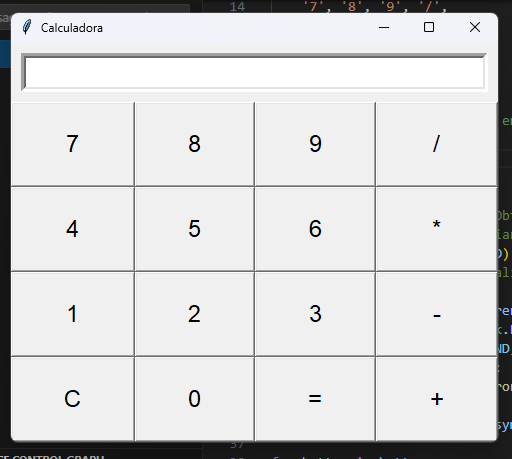

# Calculadora con interfaz gráfica

En el presente directorio, se utilizó el módulo Tkinter para crear una interfaz gráfica para una calculadora.

Se aprendió a hacer ventanas que muestran mensajes, con botones y también entradas de texto. A todos estos, se enseñó a darle estilos, con la tipografía, tamaño de la letra, "alignment", darles funciones mediante "command=", etc... También se repasaron temas anteriores"

# Instrucciones de uso

¿Qué hay que tener instalado para ejecutar el programa? ¿Qué comando utilizar?

```
py calculadora.py
```

# Demostración de ejecución



